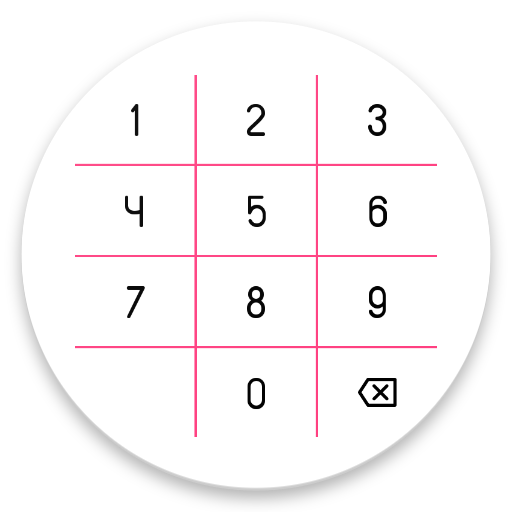

Numpad
======
Numaric inputs made easy with Numpad

Demo
----



Usage
-----
include namespace
```groovy
        xmlns:app="http://schemas.android.com/apk/res-auto"
```
Numpad xml representation
```groovy
        <com.fxn769.Numpad
                android:id="@+id/num"
                android:layout_width="300dp"
                android:layout_height="400dp"
                android:layout_gravity="center"
                android:layout_marginBottom="50dp"
                numpad:numpad_background_resource="@drawable/numpad_background"
                numpad:numpad_fontpath="fonts/custom_font.ttf"
                numpad:numpad_grid_background_color="@color/colorAccent"
                numpad:numpad_grid_line_thickness="2dp"
                numpad:numpad_grid_visible="true"
                numpad:numpad_image_resource="@drawable/ic_backspace"
                numpad:numpad_text_color="#000000"
                numpad:numpad_text_limit="10"
                numpad:numpad_text_size="18dp" />
```

Download
--------

 [  ](https://bintray.com/fxn769/android_projects/Numpad/_latestVersion)  or grab via Gradle:
```groovy
        compile 'com.fxn769:numpad:1.0'
```
or Maven:
```xml
        <dependency>
          <groupId>com.fxn769</groupId>
          <artifactId>numpad</artifactId>
          <version>1.0</version>
          <type>pom</type>
        </dependency>
```
or ivy:
```xml
        <dependency org='com.fxn769' name='numpad' rev='1.0'>
          <artifact name='numpad' ext='pom' ></artifact>
        </dependency>
```
Snapshots of the development version are available in [Sonatype's `snapshots` repository][snap].

License
--------

    Copyright 2017 Akshay Sharma

    Licensed under the Apache License, Version 2.0 (the "License");
    you may not use this file except in compliance with the License.
    You may obtain a copy of the License at

       http://www.apache.org/licenses/LICENSE-2.0

    Unless required by applicable law or agreed to in writing, software
    distributed under the License is distributed on an "AS IS" BASIS,
    WITHOUT WARRANTIES OR CONDITIONS OF ANY KIND, either express or implied.
    See the License for the specific language governing permissions and
    limitations under the License.


 [snap]: https://oss.sonatype.org/content/repositories/snapshots/

