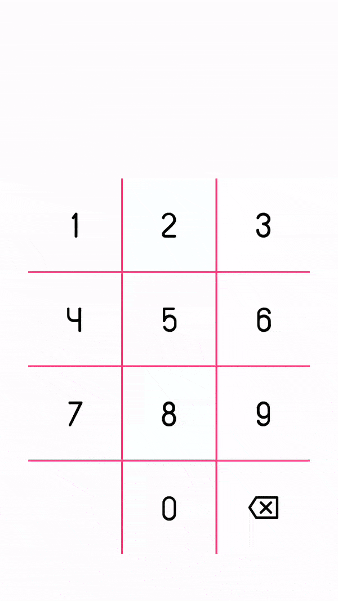

[](https://android-arsenal.com/details/1/6600)

Numpad
======
Number input made easy with Numpad


Demo
----


Usage
-----
include namespace
```groovy
        xmlns:numpad="http://schemas.android.com/apk/res-auto"
```
Numpad xml representation
```groovy
        <com.fxn769.Numpad
                android:id="@+id/num"
                android:layout_width="300dp"
                android:layout_height="400dp"
                android:layout_gravity="center"
                android:layout_marginBottom="50dp"
                numpad:numpad_background_resource="@drawable/numpad_background"
                numpad:numpad_fontpath="fonts/custom_font.ttf"
                numpad:numpad_grid_background_color="@color/colorAccent"
                numpad:numpad_grid_line_thickness="2dp"
                numpad:numpad_grid_visible="true"
                numpad:numpad_image_resource="@drawable/ic_backspace"
                numpad:numpad_text_color="#000000"
                numpad:numpad_text_limit="10"
                numpad:numpad_text_size="18dp"
                numpad:numpad_comma="." />
```

get added data from listner
```groovy
        Numpad numpad = findViewById(R.id.num);
        numpad.setOnTextChangeListner((String text, int digits_remaining) -> {
                   Log.d("input",text+"  "+digits_remaining);
                });
```

Download
--------

 [  ](https://bintray.com/fxn769/android_projects/Numpad/_latestVersion)  or grab via Gradle:
```groovy
        implementation 'com.fxn769:numpad:1.0'
```
or Maven:
```xml
        <dependency>
          <groupId>com.fxn769</groupId>
          <artifactId>numpad</artifactId>
          <version>1.0</version>
          <type>pom</type>
        </dependency>
```
or ivy:
```xml
        <dependency org='com.fxn769' name='numpad' rev='1.0'>
          <artifact name='numpad' ext='pom' ></artifact>
        </dependency>
```
Snapshots of the development version are available in [Sonatype's `snapshots` repository][snap].


## License
Licensed under the Apache License, Version 2.0, [click here for the full license](/LICENSE).

## Author & support
This project was created by [Akshay Sharma](https://akshay2211.github.io/).

> If you appreciate my work, consider buying me a cup of :coffee: to keep me recharged :metal: by [PayPal](https://www.paypal.me/akshay2211)

> I love using my work and I'm available for contract work. Freelancing helps to maintain and keep [my open source projects](https://github.com/akshay2211/) up to date!

[](http://forthebadge.com)


 [snap]: https://oss.sonatype.org/content/repositories/snapshots/

